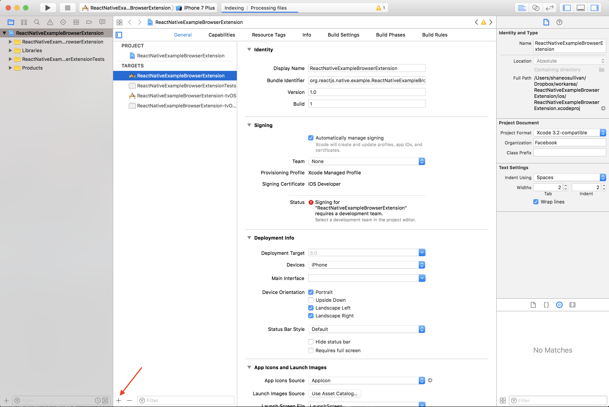
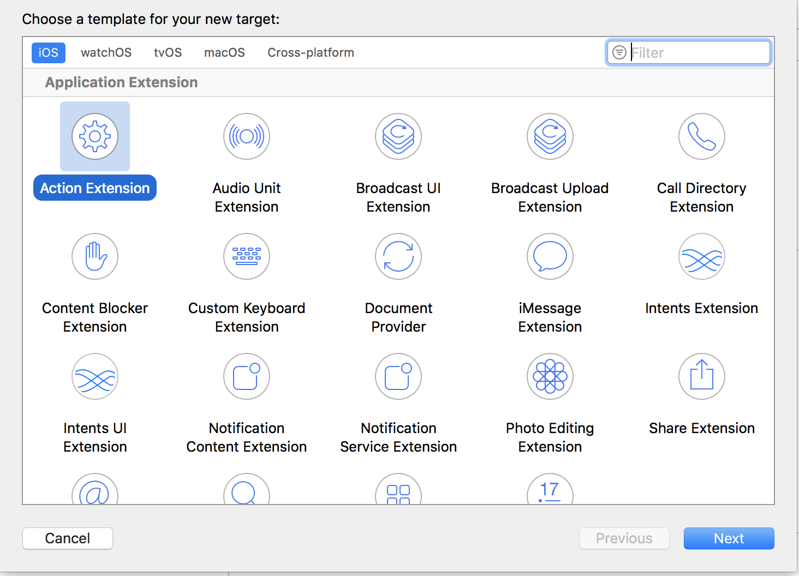
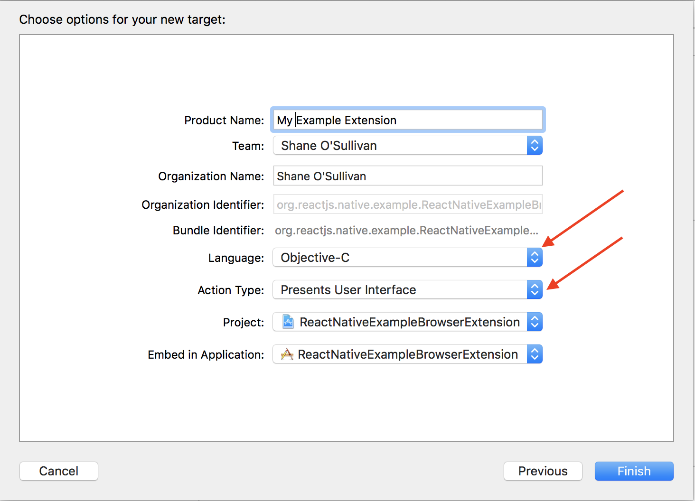
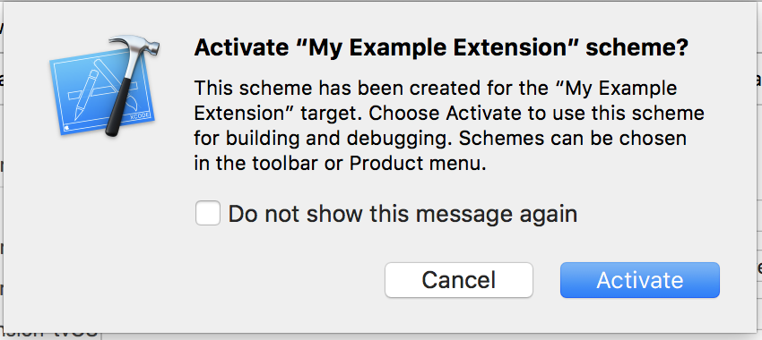
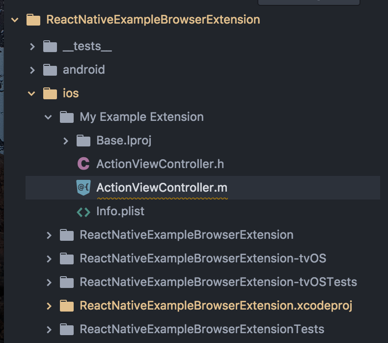

# ReactNativeExampleBrowserExtension
Example React Native app that implements a browser extension.
This example was created with React Native version 0.48.1.  The instructions
may require updating for later versions.  This project builds on the great
instructions published by PromptWorks at https://www.promptworks.com/blog/building-ios-app-extensions-with-react-native
, which did a bit less than we're aiming for here, and were for an earlier version
of React Native so could be a bit out of date.

## Instructions for iOS (work in progress)
1. Create a React Native app, e.g.
  `react-native init MyReactNativeExampleBrowserExtension`
  This should create a folder called MyReactNativeExampleBrowserExtension in
2. Open the iOS app in XCode, using the file `MyReactNativeExampleBrowserExtension/ios/MyReactNativeExampleBrowserExtension.xcodeproj`
3. Select your project in the left bar, click the `General` tab, and click the
   plus icon to add a new Target
   
4. Choose `Action Extension` to create the extension
  
  Make sure to choose Objective-C as the language.
  
  If you see a prompt to `Activate "My Example Extension" scheme`, click the `Activate` button.
  
5. At this point you have an Action Extension in your app.  Note that a new folder named after the name of the extension you chose, in this example `My Example Extension`, has been created in the `ios` folder, and contains three files, `ActionViewController.h`, `ActionViewController.m` and `Info.plist`.  We'll be
rewriting the code in `ActionViewController.m` pretty soon.
  
